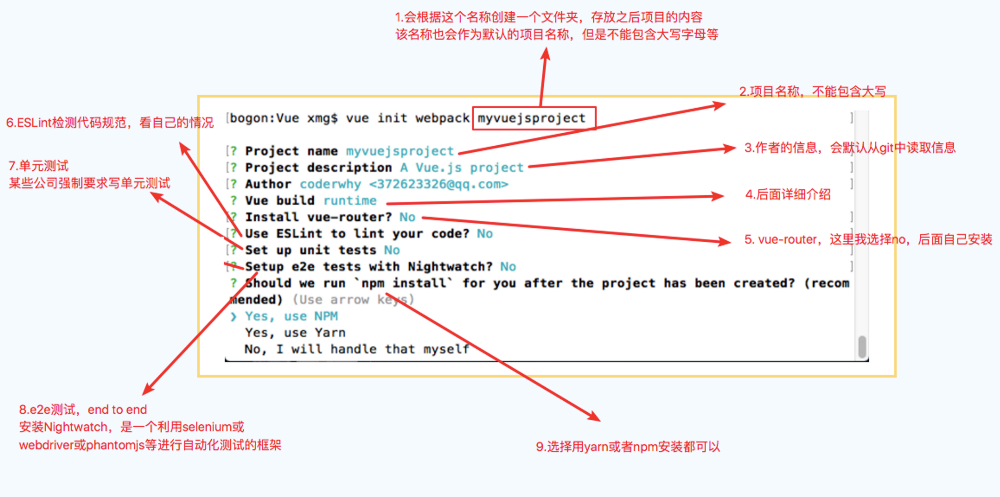

<!-- <h1 align="center">学习Vue.js之路</h1> -->
<div align="center">
  
  <h1>学习Vue.js之路</h1>
</div>

- [一、邂逅Vue.js](#一邂逅vuejs)
  - [1.1 认识Vue.js](#11-认识vuejs)
  - [1.2 安装Vue](#12-安装vue)
  - [1.3 Vue的初体验](#13-vue的初体验)
  - [1.4 Vue中的MVVM](#14-vue中的mvvm)
  - [1.5 创建Vue时，options可以放哪些东西](#15-创建vue时options可以放哪些东西)
- [二、插值语法](#二插值语法)
- [三、v-bind动态绑定属性](#三v-bind动态绑定属性)
  - [3.1 v-bind绑定基本属性](#31-v-bind绑定基本属性)
  - [3.2 v-bind动态绑定class](#32-v-bind动态绑定class)
  - [3.3 v-bind动态绑定style](#33-v-bind动态绑定style)
- [四. 计算属性](#四-计算属性)
  - [4.1 计算属性的本质](#41-计算属性的本质)
  - [4.2 计算属性和methods对比](#42-计算属性和methods对比)
- [五. 事件监听](#五-事件监听)
  - [5.1 事件监听的基本使用](#51-事件监听的基本使用)
  - [5.2 参数问题](#52-参数问题)
  - [5.3 修饰符](#53-修饰符)
- [六. 条件判断](#六-条件判断)
  - [6.1 v-if/v-else/v-else-if的使用](#61-v-ifv-elsev-else-if的使用)
  - [6.2 登录小案例](#62-登录小案例)
  - [6.3 v-show](#63-v-show)
- [七. 循环遍历](#七-循环遍历)
  - [7.1 遍历数组](#71-遍历数组)
  - [7.2 遍历对象](#72-遍历对象)
  - [7.3 数组哪些方法是响应式的](#73-数组哪些方法是响应式的)
  - [7.4 作业完成](#74-作业完成)
- [八. 书籍案例](#八-书籍案例)
- [九. v-model的使用](#九-v-model的使用)
  - [9.1 v-model的基本使用](#91-v-model的基本使用)
  - [9.2 v-model结合radio，checkbox，select的使用](#92-v-model结合radiocheckboxselect的使用)
  - [9.3 v-model的修饰符](#93-v-model的修饰符)
- [十. 组件化开发](#十-组件化开发)
  - [10.1 认识组件化](#101-认识组件化)
  - [10.2 组件的基本使用](#102-组件的基本使用)
  - [10.3 全局组件和局部组件](#103-全局组件和局部组件)
  - [10.4 父组件和子组件](#104-父组件和子组件)
  - [10.5 组件注册的语法糖](#105-组件注册的语法糖)
  - [10.6 模版的分类写法](#106-模版的分类写法)
  - [10.7 数据的存放](#107-数据的存放)
  - [10.8 父子组件的通信](#108-父子组件的通信)
  - [10.9 项目](#109-项目)
  - [10.10 父子组件的访问](#1010-父子组件的访问)
  - [10.11 slot的使用](#1011-slot的使用)
- [十一、前端模块化](#十一前端模块化)
  - [11.1 为什么要使用模块化](#111-为什么要使用模块化)
  - [11.2 ES6中模块化的使用](#112-es6中模块化的使用)
- [十二、webpack](#十二webpack)
  - [12.1 什么是webpack](#121-什么是webpack)
  - [12.2 webpack的起步](#122-webpack的起步)
  - [12.3 webpack和loader](#123-webpack和loader)
  - [12.4 webpack中配置Vue](#124-webpack中配置vue)
  - [12.5 webpack的plugin](#125-webpack的plugin)
  - [12.6 搭建本地服务器](#126-搭建本地服务器)
  - [12.7 配置文件的分离](#127-配置文件的分离)
- [十三、Vue CLI](#十三vue-cli)
  - [13.1 什么是CLI](#131-什么是cli)
  - [13.2 CLI2初始化项目的过程](#132-cli2初始化项目的过程)
  - [13.3 CLI2生成的目录结构的解析](#133-cli2生成的目录结构的解析)
  - [13.4 runtime-compiler和runtime-only的区别](#134-runtime-compiler和runtime-only的区别)
  - [13.5 Vue CLI3](#135-vue-cli3)
- [十四、Vue-Router](#十四vue-router)
  - [14，1 什么是前端路由](#141-什么是前端路由)
  - [14.2 路由的基本配置](#142-路由的基本配置)
  - [14.3 细节处理](#143-细节处理)
  - [14，4 动态路由](#144-动态路由)
  - [14.5 路由的懒加载](#145-路由的懒加载)
  - [14.6 参数传递](#146-参数传递)
  - [14.7 路由嵌套](#147-路由嵌套)
  - [14.8 导航守卫](#148-导航守卫)
  - [14.9 keep-alive](#149-keep-alive)
  - [14.10 练习TabBar的封装过程](#1410-练习tabbar的封装过程)
- [十五、Promise](#十五promise)
  - [15.1 Promise的基本使用](#151-promise的基本使用)
  - [15.2 Promise的链式调用](#152-promise的链式调用)
  - [15.3 Promise的all方法](#153-promise的all方法)
- [十六、Vuex](#十六vuex)
  - [16.1 什么是状态管理](#161-什么是状态管理)
  - [16.2 Vuex的基本使用](#162-vuex的基本使用)
  - [16.3 核心概念](#163-核心概念)
  - [16.4 目录组织方式](#164-目录组织方式)
- [十七、网络请求封装](#十七网络请求封装)
  - [17.1 网络请求方式的选择](#171-网络请求方式的选择)
  - [axios的基本使用](#axios的基本使用)
  - [17.2 axios的并发请求](#172-axios的并发请求)
  - [17.3 axios的相关配置](#173-axios的相关配置)
  - [17.4 axios的创建实例](#174-axios的创建实例)
  - [17.5 axios的封装](#175-axios的封装)
  - [17.6 axios的拦截器](#176-axios的拦截器)
- [十八、项目开发](#十八项目开发)
  - [18.1 划分目录结构](#181-划分目录结构)
  - [18.2 引用了两个css文件](#182-引用了两个css文件)
  - [18.3 vue.config.js和.editorconfig](#183-vueconfigjs和editorconfig)
  - [18.4 项目的模块划分: tabBar -\> 路由映射关系](#184-项目的模块划分-tabbar---路由映射关系)
  - [18.5 axios的封装](#185-axios的封装)
  - [首页开发](#首页开发)

## 一、邂逅Vue.js

### 1.1 认识Vue.js

- 为什么学习vue.js
  - 1.前端必备技能
  - 2.岗位多，绝大互联网公司都在使用Vue
  - 3.提高开发效率
  - 4.高薪必备技能（Vue2+Vue3）
- vue的读音
  - 概念：Vue (读音 /vjuː/，类似于 view) 是一套 构建用户界面 的 渐进式 框架
- vue的渐进式
  - Vue 的设计非常注重灵活性和“可以被逐步集成”这个特点。根据你的需求场景，你可以用不同的方式使用 Vue：
    - 无需构建步骤，渐进式增强静态的 HTML
    - 在任何页面中作为 Web Components 嵌入
    - 单页应用 (SPA)
    - 全栈 / 服务端渲染 (SSR)
    - Jamstack / 静态站点生成 (SSG)
    - 开发桌面端、移动端、WebGL，甚至是命令行终端中的界面
- vue的特点
  - 组件化开发
  - 响应式数据绑定
  - 虚拟DOM和diff算法
  - MVVM模式
  - 渐进增强

### 1.2 安装Vue

- cdn引入
- 下载引入
- npm安装（主流使用方式）

### 1.3 Vue的初体验

- hello Vue.js
- mustache语法-> {{}}
- Vue列表展示 v-for的使用
- 体验vue的响应式：例如后面给数组追加元素的时候，新的元素也可以在界面中渲染出来
- Vue计数器小案例
- 事件监听：click->methods

```vue
  <div id="app">
    <h2>{{message}}</h2>
    <ul>
      <li v-for="item in books">item</li>
    </ul>
    <h2>{{counter}}</h2>
    <button v-on:click="counter++">+</button>
    <button v-on:click="counter--">-</button>
  </div>
  <script>
    const app = new Vue({
      el: '#app',
      data: {
        message: 'Hello Vue.js',
        books:['book1', 'book2', 'book3'],
        counter: 0
      }
    })
  </script>
```

### 1.4 Vue中的MVVM


### 1.5 创建Vue时，options可以放哪些东西

- el
- data
- methods
- 生命周期函数

## 二、插值语法

- mustache语法 {{}}
- v-once 只展示第一次的数据，不会根据数据的改变而改变
- v-html 显示以html标签字符串传输的数据
- v-text 一般不使用，因为不够灵活，因为text属性会覆盖所有标签内容，无法拼接使用，我们一般使用Mustache语法展示
- v-pre 显示的是内容本身，不展示解析之后的数据
- v-cloak (斗篷）的作用是在Vue解析之前，div中有一个属性v-cloak,在Vue解析之后，删除v-cloak属性
- 示例：

```vue
  <style>
    [v-cloak] {
      display: none;
    }
  </style>
<!-------------------------->
  <div id="app" v-cloak>
    <h2>{{message}}</h2>
    <h2 v-once>{{message}}</h2>
    <h2 v-html>{{htmlString}}</h2>
    <h2 v-text="覆盖标签所有内容">{{message}}</h2>
    <h2 v-pre>{{message}}</h2>
  </div>
<!-------------------------->
  <script>
    setTimeout(function () {
      const app = new Vue({
        el: '#app',
        data: {
          message: 'Hello World!',
          htmlString: '<a href= "https://www.baidu.com">百度一下</a>',
        }
      })  
    },1000)
  </script>
```

## 三、v-bind动态绑定属性

### 3.1 v-bind绑定基本属性

- v-bind:src
- href
- 示例：

```vue
  <div id="app">
    <h2 v-bind:href="'https://www.baidu.com'">百度一下</h2>
    
  </div>
```

### 3.2 v-bind动态绑定class

- 对象语法：class='{类名：boolean}'
- 数组语法: class = '[class1,class2]'
- 示例：

```vue
  <style>
    .active {
      color: red;
    }
    .line {
      font-size: 50px;
    }
  </style>
  <div id="app">
    <h2 :class="'active'">绑定对象</h2>
    <h2 :class="{'active':true}">如果true，则绑定对象，否则，不绑定对象</h2>
    <h2 :class="['active','line']">绑定数组</h2>
  </div>
```

### 3.3 v-bind动态绑定style

- 对象语法：style="{key:value, ...}"
- 数组语法: style="["{key:value, ...}", "{key:value, ...}", ...]"
- 示例：

```vue
  <div id="app">
    <h2 :style="{color:'red', fontSize:'50px'}"></h2>
    <h2 :style="[{color:'red'},{fontSize:'50px'}]"></h2>
  </div>
```

## 四. 计算属性

### 4.1 计算属性的本质

- fullname:{set(),get()}
- 计算属性的本质，实际上是一个属性，只不过在里面，我们通常实现了他的get方法
- 引用属性，通常直接使用属性名{{fullname}}，不需要使用fullname()
- 示例：

```vue
  <script>
    const app = Vue({
      el: '#app',
      computed: {
        fullName () {
          return 'name'
        }
      }
    })
  </script>
```

### 4.2 计算属性和methods对比

- 计算属性在多次使用时，只会调用一次，只有在检测到值发生变化的时候，会重新计算，他是有缓存的
- 而methods方法，是每次调用都会重新计算，所以，通常情况下用计算属性会提升程序效率
- 示例：

```vue
  <div id="app">
    <h2>您的名字是：{{fullName}}</h2>
    <h2>您的名字是：{{getFullName()}}</h2>
  </div>
<!-------------------------->
  <script>
    const app = Vue({
      el: '#app',
      data: {
        firstName: 'Qi',
        lastName: 'Hao'
      },
      computed: {
        fullName() {
          return this.firstName + this.lastName
        }
      },
      methods: {
        getFullName() {
          return this.firstName + this.lastName
        }
      }
    })
  </script>  
```

## 五. 事件监听

### 5.1 事件监听的基本使用

- 事件监听v-on
- v-on的语法糖是@click
- 示例：

```vue
  <div id='app'>
    <button v-on: click="counter++">+</button>
    <button @click="decrement()">-</button>
  </div>
<!-------------------------->
  <script>
    const app = Vue({
      el: '#app',
      data: {
        counter: 0
      },
      methods: {
        increment() {
          this.counter++
        },
        decrement() {
          this.counter--
        }
      }
    })
  </script>
```

### 5.2 参数问题

- 事件调用函数方法，如果没有参数，可以省略()
- 事件调用需要形参的函数方法时，分为两种情况
  - 调用时省略了(),则默认形参传入点击产生的event事件
  - 调用时用了(),则默认形参传入undefined
- 事件调用函数方法，如果需要主动传入点击产生的event事件，那么需要用$event
- 示例：

```vue
  <div id='app'>
    <button @click="btnClick">按钮1</button>
    <button @click="btnClick2">按钮2</button>
    <button @click="btnClick2()">按钮3</button>
    <button @click="btnClick(aa,$event)">按钮4</button>
  </div>
<!-------------------------->
  <script>
    const app = new Vue({
      el: '#app',
      methods: {
        btnClick() {
          console.log('btnClick');
        },
        btnClick2(param) {
          console.log('btnClick2' + param);
        },
        btnClick3(param, event) {
          console.log('btnClick3' + param + event);
        }
      }
    })
  </script>
```

### 5.3 修饰符

- stop 当前控件响应完，阻止冒泡
- prevent 阻止控件的默认事件
- @keyup.enter 监听键盘的回车键
- .once 只执行一次
- .native 组件化开发会用到，监听组件的根元素的原生事件:如果想监听一个组件的原生事件时，必须给对应的事件加上.native修饰符，才能进行监听
- 示例：

```vue
  <div id='app'>
    <div @click="divClick">
      <button @click.stop="stopClick">stop</button>
    </div>
    <form action="baidu">
      <input type="submit" value="提交" @click.prevent="preventClick">
    </form>
    <input type="text" @keyup="keyup">
    <input type="text" @keyup.enter="enter">
    <button @click.once="onceClick">once</button>
  </div>
<!-------------------------->
  <script>
    const app = new Vue({
      el: '#app',
      methods: {
        divClick() {
          console.log('divClick');
        },
        stopClick() {
          console.log('stopClick');
        },
        preventClick() {
          console.log('preventClick');
        },
        keyup() {
          console.log('监听所有键盘点击一次');
        },
        enterClick() {
          console.log('监听键盘的enter键，调用');
        },
        onceClick() {
          console.log('只调用一次');
        }
      }
    })
  </script>
```

## 六. 条件判断

### 6.1 v-if/v-else/v-else-if的使用

- v-if 后面接boolean类型 如果为true则执行这条标签 否则不执行
- v-else 结合 v-if 来使用
- v-else-if 结合 v-if 和 v-else 来使用
- 示例：

```vue
  <div id="app">
    <h2 v-if="score>=90">优秀</h2>
    <h2 v-else-if="score>=80">良好</h2>
    <h2 v-else-fi="score>=60">及格</h2>
    <h3 v-else>不及格</h3>
  </div>
<!-------------------------->
  <script>
    const app = new Vue({
      el: '#app',
      data: {
        score: 65
      }
    })
  </script>
```

### 6.2 登录小案例

- 一个切换登录方式的一个小示例
- key 修饰符的作用是，阻止输入控件的复用，值相同，则复用， 否则则不复用
- 这里如果key修饰符不设置或者值相同，那么在切换用户登录的时候，用户已经输入的内容则不会清空。
- 原理是：Vue在渲染DOM的时候，会先在内存中创建一个虚拟DOM，为了节省开销，会尽可能的采用复用机制，而只改变其属性，所以id等属性都会变，但是其已经输入的内容不会变。
- 示例：

```vue
  <div id="app">
    <div v-if="isUser">
      <h2>用户名登录</h2><br>
      <input type="text" id="name" placeholder="请输入用户名"><br>
    </div>
    <div v-else>
      <h2>用户邮箱登录</h2>
      <input type="email" id="email" placeholder="请输入邮箱">
    </div>
  </div>
  <script>
    const app = new Vue({
      el: '#app',
      data: {
        isUser: true
      }
    })
  </script>
```

### 6.3 v-show

- v-show和v-if的区别
  - v-if 当满足false条件的时候，元素则不会存在DOM中，所以本质是每次都会重新创建和删除
  - v-show 当满足false条件的时候，只是给元素添加了个样式：display：none，不删除
- 示例：

```vue
  <div id='app'>
    <h2 v-if = "false" id = "aaa">v-if</h2>
    <h2 v-show="false" id = "bbb">v-show</h2>
  </div>
```

## 七. 循环遍历

### 7.1 遍历数组

- v-for修饰符遍历数组的使用
- 示例：

```vue
  <div id="app">
    <h2 v-for="item in books">{{item}}</h2>
    <h2 v-for="(item, index) in books">{{index}} {{item}}</h2>
  </div>
  <script>
    const app = new Vue({
      el: '#app',
      data: {
        books: ['book1', 'book2', 'book3']
      }
    })
  </script>
```

### 7.2 遍历对象

- v-for修饰符遍历对象的使用
- 遍历格式(value, key) 与 (value, key, index)
- 示例：

```vue
  <div id="app">
    <h2 v-for="value in user">{{value}}</h2>
    <h2 v-for="(value, key) in user">{{key}} {{value}}</h2>
    <h2 v-for="(value, key, index) in user">{{index}} {{key}} {{value}}</h2>
  </div>
  <script>
    const app = new Vue({
      el: '#app',
      data: {
        user: {
          name: 'Hao',
          age: 30,
          sex: male
        }
      }
    })
  </script>
```

### 7.3 数组哪些方法是响应式的

- 响应式：
  - push 尾部增加一个元素
  - pop 删除尾部元素
  - shift 删除第一个元素
  - unshift 首部插入一个元素
  - sort 排序
  - reverse 颠倒
  - splice ：splice(start: number, deleteCount: number, ...items: T[])
    - 删除元素
      - start 起始位置
      - deleteCount 删除个数，大于0:从start开始，删除deleteCount个元素。缺省：从start开始，删除后面所有元素
      - items 缺省
    - 插入元素
      - start 起始位置
      - deleteCount 传入0
      - items 从start处，插入items元素
    - 替换元素
      - start 起始位置
      - deleteCount 传入大于0
      - items 从start处，替换deleteCount个items元素
- 非响应式
  - 通过索引值修改数组中的元素，不是响应式的
- 示例

```vue
  <script>
    const app = new Vue({
      el: '#app',
      data: {
        letters: ['a', 'b', 'c', 'd']
      },
      methods: {
        func() {
          this.letters.push('e')
          this.letters.pop()
          this.letters.shift()
          this.letters.unshift('a')
          this.letters.reverse()
          this.letters.sort()
          this.letters.splice(1,1)
          this.letters.splice(1)
          this.letters.splice(1,0,'b','c','d')
          this.letters.splice(1,1,'e')
          this.letters[1] = 'f'
        }
      }
    })
  </script>
```

### 7.4 作业完成

- 作业：完成一个列表展示数据，点击哪条，哪条变颜色
- 思路：利用v-bind class来实现
- 示例：

```vue
  <style>
    .aaa {
      color: red;
    }
  </style>
<!-------------------------->
  <div id="app">
  <ul>
    <li v-for="(item, index) in books" :class="{aaa: currentIndex === index}" @click="liClick(index)">{{item}}</li>
  </ul>
  </div>
  <script>
    const app = new Vue({
      el: '#app',
      data: {
        books: ['book1', 'book2', 'book3', 'book4'],
        currentIndex: 0,
        aaa
      },
      methods: {
        liClick(index) {
          this.currentIndex = index
        }
      }
    })
  </script>
```

## 八. 书籍案例

- 案例要求：用列表展示书籍信息，表格包含：书籍名称，价格，日期，数量，操作删除，可以增减数量，同步算出总价，如果全部删除，则表格删除，显示购物车为空字样。

## 九. v-model的使用

### 9.1 v-model的基本使用

- v-model相当于是数据的双向绑定
- v-model其实相当于一个语法糖，本质是，用v-bind绑定一个value，又用v-on给当前控件绑定一个input事件
- 示例：

```vue
  <div id="app">
    <h2>{{message}}</h2>
    <label>
      <input type="text" v-model="message">
      <input type="text" :value="message" @input="valueChange">
      <input type="text" :value="message" @input="message = $event.target.value">
    </label>
  </div>
<!-------------------------->
  <script>
    const app = new Vue({
      el: '#app',
      data: {
        message: 'message'
      },
      methods: {
        valueChange(event) {
          this.message = event.target.value
        }
      }
    })
  </script>
```

### 9.2 v-model结合radio，checkbox，select的使用

- 示例

```vue
  <div id="app">
  <!--  radio 如果v-model绑定同一个值，则可以省略name="sex"，也能达到选择互斥效果-->
    <label for="male">
      <input type="radio" value="男" name="sex" id="male" v-model="sex">男
    </label>
    <label for="fmale">
      <input type="radio" value="女" name="sex" id="fmale" v-model="sex">女
    </label>
  <!--checkbox 单选-->
    <label for="agree">
      <input type="checkbox" id="agree" v-model="isAgree">同意
    </label>
  <!--checkbox 多选-->
    <label for="check">
      <input type="checkbox" value="book1" v-model="checkboxBooks">book1
      <input type="checkbox" value="book2" v-model="checkboxBooks">book2
      <input type="checkbox" value="book3" v-model="checkboxBooks">book3
      <input type="checkbox" value="book4" v-model="checkboxBooks">book4
    </label>
  <!--select 用multiple修饰符，则是多选，去掉则是单选-->
  <select name="select" v-model="selectBooks" multiple>
    <option value="book1">book1</option>
    <option value="book2">book2</option>
    <option value="book3">book3</option>
  </select>
  </div>
<!-------------------------->
  <script>
    const app = new Vue({
      el: '#app',
      data: {
        sex: '男',
        isAgree: false,
        checkboxBooks: [],
        selectBooks: [] 
      },
    })
  </script>
```

### 9.3 v-model的修饰符

- lazy 当输入框元素失去焦点或者输入enter的时候才会更改model
- number 保持number类型
- trim 去掉空格
- 示例：

```vue
  <div id="app">
    <input type="text" v-model.lazy="message">
    <input type="text" v-model.number="number">
    <input type="text" v-model.tirm="message">
  </div>
  <script>
   const app = new Vue({
     el: '#app',
     data: {
       message: 'message',
       number: 123
     }
   })
  </script>
```

## 十. 组件化开发

### 10.1 认识组件化

- 注册组件分为散步
  - 创建组件控制器对象
  - 注册组件
  - 使用组件

### 10.2 组件的基本使用

- 示例：

```vue
  <div id="app">
  <!--3.使用组件-->
    <cpn></cpn>
  </div>
<!-------------------------->
  <script>
    // 1.创建组件控制器对象
    const cpnContrutor = Vue.extend({
      template: `
        <div>
          <h2>我是内容</h2>
        </div>  
      `
    })
    // 2.注册组件
    Vue.component('cpn', cpnContrutor)
  </script>
```

### 10.3 全局组件和局部组件

- 以上7.2的内容注册方式就是全局组件
- 在Vue实例中，利用components方法声明，则是局部组件的注册方式
- 局部组件，只有在当前Vue实例管理的DOM元素中才能使用
- 示例

```vue
  <div id="app">
    <my_cpn></my_cpn>
  </div>
  <div id="app2">
  <!--这里就不可以使用my_cpn组件-->
  <!--<my_cpn></my_cpn>-->
  </div>
  <script>
    const app = new Vue({
      el: '#app',
      components: {
        my_cpn: cpnContrutor
      }
    })
  </script>
```

### 10.4 父组件和子组件

- 示例：

```vue
  <script>
  // 子组件
    const cpnContrutor1 = Vue.extend({
      template: 
              `
                <div>
                  <h2>我是内容</h2>
                </div>
              `
    })
    Vue.component('cpn1', cpnContrutor1)
  // 父组件
    const cpnContrutor2 = Vue.extend({
      template: `
        <div>
          <h2>我是标题</h2>
          <cpn1></cpn1>
        </div>
      `
    })
    Vue.component('cpn2', cpnContrutor2)
  </script>
```

### 10.5 组件注册的语法糖

- 示例：

```vue
  <script>
  // 全局组件注册
    Vue.component('cpn', {
      template: `
        <div>
          <h2>我是全局组件</h2>
        </div>
      `
    })
  // 局部组件注册
    const app = new Vue({
      components: {
        'my_cpn': {
          template: `
            <div>
              <h2>我是局部组件</h2>
            </div>
          `
        }
      }
    })
  </script>
```

### 10.6 模版的分类写法

- script
- 示例：

```vue
  <script type="text/x-template" id="cpn">
    <div>
      <h2>我是script分离写的组件模版</h2>
    </div>
  </script>
```

- template
- 示例：

```vue
  <template id="cpn">
    <div>
      <h2>我是template分离写的组件模版</h2>
    </div>
  </template>
<!--  使用以上两种模版-->
  <script>
    Vue.component('my_cpn',{
      template: '#cpn'
    })
  </script>
```

### 10.7 数据的存放

- 子组件不能直接访问父组件
- 子组件中有自己的data，而且必须是一个函数，函数返回一个对象，对象保存着数据，为什么必须是一个函数呢？
- 是因为多个模版实例去调用data的时候，如果data是一个对象，那么多个模版访问的是同一个对象，修改对象数据会互相干扰。
- 那么如果data是一个函数，函数里返回一个对象，那么多个模版实例调用data的时候，会创建多个对象一一对应，则不会互相干扰。
- 示例：

```vue
  <script>
    Vue.component('my_cpn', {
      template: '#cpn',
      data() {
        return {
          name: 'Hao'
        }
      }
    })
  </script>
```

### 10.8 父子组件的通信

- 父传子：props 如果属性名为驼峰形式：例如cMovies,在标签引用的时候，要写成c-movies
- 子传父：$emit 要通过自定义事件来发射信号信息，传到父组件里接收数据
- 示例：

```vue
  <div id="app">
  <!--  父传子-->
    <my_cpn :c-movies="movies" :cmessage="message" @item-click="cpnClick"></my_cpn>
  </div>
<!-------------------------->
  <template id="cpn">
    <div>
      <label>{{cMovies}}</label>
      <label>{{cmessage}}</label>
      <div>
        <button v-for="item in cMovies" @click="btnClick(item)">按钮</button>  
      </div>
    </div>
  </template>
<!-------------------------->
  <script>
    const my_cpn = {
      template: '#cpn',
      props: {
        cMovies: {
          type: Array,
          default: []
        },
        cmessage: {
          type: String,
          default: ''
        }
      },
      methods: {
        btnClick(item) {
          this.$emit('item-click',item)
        }
      }
    }
    const app = Vue({
      el: '#app',
      data: {
        movies: ['千与千寻', '哈尔的移动城堡'],
        message: '宫崎骏'
      },
      methods: {
        cpnClick(item) {
          console.log(item);
        }
      },
      components: {
        'my_cpn': my_cpn
      }
    })
  </script>
```

### 10.9 项目

- <https://github.com/coderwhy/HYMall>

### 10.10 父子组件的访问

- $children & $refs
- 父组件访问子组件：使用$children或者$refs(reference引用)
  - 通过$children获得的是一个数组，访问其中子组件必须通过索引，但是当子组件过多时，就往往不能确定其索引值
  - 所以我们通常需要子组件绑定一个特定的ID，这时，就用到了$refs/ref
  - $refs和ref指令通常是一起使用的，$refs获取的是一个对象类型，比$children更常用

  ```vue
    <child-cpn1 ref="child1"></child-cpn1>
    <child-cpn2 ref="child2"></child-cpn2>
    //调用
    this.$refs.child1
    this.$refs.child2
  ```

- 子组件访问父组件：使用$parent
  - 尽量不要使用$parent访问父组件，子组件应该避免直接访问父组件数据，因为耦合度太高
  - 如果将这个子组件放到另一个组件之内，很可能该父组件没有对应的属性，往往会引起问题
  - 更不要做通过$parent直接修改父组件状态，很不利于我们调试和维护
    ```this.$parent```
- 访问根组件：使用$root
  - 访问根组件，直接访问到Vue实例
    ```this.$root```

### 10.11 slot的使用

- 基本使用
  - 在子组件中，使用特殊的元素<slot>就可以为子组件开启一个插槽
  - 该插槽插入什么内容取决于父组件如何使用
  - 如果有多个值，同时放入到组进行替换时，一起作为插槽元素替换

```vue
  <template id="myCpn">
    <div>
      <slot>我是默认插槽</slot>
    </div>
  </template>
  <div id="app">
    <my-cpn></my-cpn>
    <my-cpn>
      <h2>我是替换插槽</h2>
      <p>我也是替换插槽</p>
    </my-cpn>
  </div>
```

- 具名插槽
  - 当子组件功能复杂的时候，插槽可能并不是一个，这时候如果想要确切的想要使用插槽位置，就用到了具名插槽
  - 例如，导航栏的子组件，分别有左边，中间，右边，这时候就应该给插槽取一个名字

```vue
  <template id="myCpn">
    <div>
      <slot name="left">我是左边</slot>
      <slot name="center">我是左边</slot>
      <slot name="right">我是左边</slot>
    </div>
  </template>
  <div id="app">
    <my-cpn slot="left">我是返回</my-cpn>
    <my-cpn slot="center">我是中间</my-cpn>
  </div>
```

- 编译的作用域
  - 父组件模版的所有东西都会在父级作用域内编译
  - 子组件模版的所有东西都会在子级作用域内编译
  - 例如：以下结果是，可以显示。

```vue
  <div id='app'>
    <cpn v-show="isShow"></cpn>
  </div>
  <template id="cpn">
    <div>
      <h2>我是子组件，猜我能不能显示</h2>
    </div>
  </template>
  <script>
    const app = new Vue({
      el: '#app',
      data: {
        isShow: true
      },
      components: {
        cpn: {
          template: '#cpn',
          data() {
            return {
              isShow: false
            }
          }
        }
      }
    });
  </script>
```

- 作用域插槽
  - 父组件替换插槽的标签，但是内容由子组件来提供

```vue
  <template id="cpn">
    <div>
  <!--    :data是命名是可以随便定义 也可以叫  :name  :abc 等-->
      <slot :data="pLanguages">
        <ul>
          <li v-for="item in pLanguages">{{item}}</li>
        </ul>
      </slot>
    </div>
  </template>
  <div id='app'>
    <cpn>
      <!--    目的是获取子组件中的pLanguages slot-scope固定写法-->
      <!--    必须使用template标签是为了更兼融老版本Vue 好像是2.5.几以下的版本 -->
      <template slot-scope="slot">
        <!--      <span v-for="item in slot.data">{{item}} - </span>-->
        <span>{{slot.data.join(' - ')}}</span>
      </template>
    </cpn>
    <cpn>
      <!--    高版本是可以任意标签，比如-->
      <div slot-scope="slot">
        <span>{{slot.data.join(' * ')}}</span>
      </div>
    </cpn>
  </div>
  <script>
    const app = new Vue({
      el: '#app',
      components: {
        cpn: {
          template: '#cpn',
          data() {
            return {
              pLanguages: ['JavaScript', 'C++', 'Swift', 'OC', 'Python']
            }
          }
        }
      }
    });
  </script>
```

## 十一、前端模块化

### 11.1 为什么要使用模块化

- 代码带来的问题
  - 比如全局变量同名问题，另外，这种代码的编写方式对js文件的依赖顺序几乎是强制性的，但是当js文件过多，比如有几十个的时候，弄清楚它们的顺序是一件比较同时的事情。
- 闭包
  - 闭包可以解决全局变量相互影响的问题，但是作为闭包里的变量，是属于局部变量，很难被外部使用。

  ```vue
  (function() {
    var flag = true
  })()
  ```

- 实现一个简单的模块化，利用返回一个对象，用moduleA接收

  ```vue
  var moduleA = (function () {
  var obj = {}
  var name = '小明'
  return obj
  })()
  ```

- 随着前端的发展，现在已经存在一些常见的模块化规范：commonJS、AMD、CMD、也有ES6的Modules等
  - commonJS模块化导出导入

  ```vue
  //导出
  var name = '小明'
  function sum(num1, num2) {
    return num1 + num2
  }
  module.exports = {
   flag: flag,
    sum: sum
  }
  //导入
  let {flag, sum} = require('moduleA')
  ```

### 11.2 ES6中模块化的使用

- export 导出

```vue
// info.js
  var name = '小明'
  function sum(num1, num2) {
    return num1 + num2
  }
  // 1.导出方式一
  export {
    name, sum
  }
  // 2.导出方式二
  export var num = 1000
  export var height = 1.77
  // 3.导出函数/类
  export function full(num1, num2) {
    return num1 + num2
  }
  export  class Person {
    run() {
      console.log('再奔跑');
    }
  }
  // 4.export default
  // 某些情况下，一个模块中包含某个功能，我们并不希望给这个功能命名，而且让导入者自己来命名，注意：一个模块只能有一个export default
  export default function (argument) {
    console.log(argument);
  }
```

- import 导入

```vue
  // 1.在HTML代码中导入，类型需要设置为module
  <script src="info.js" type="module"></script>
  // 2.导入{}中定义的变量
  import {name, sum} from "./info.js";
  // 3.直接导入export定义的变量
  import {height, num} from "./info.js"
  // 4.导入export定义的函数和类
  import {full,Person} from "./info.js";
  // 5.export default
  import add from "./info.js";
  // 6.统一全部导入，通过* as可以导入模块中所有的export变量，但是通常情况下我们需要给*起一个别名，方便后续的使用
  import * as info from "./info.js"
  console.log(aaa.num);
  aaa.default('default')
```

## 十二、webpack

### 12.1 什么是webpack

- 概念
  - 官方：从本质上来讲，webpack是一个现代的JavaScript应用的静态模块打包工具
  - 但是它是什么呢？用概念解释概念，还是不清晰。我们可以从两点来解释：模块和打包
    - 前端模块化：webpack让我们可以进行模块化开发，并且会帮助我们处理模块间的依赖关系。而且不仅仅是JavaScript文件，我们的CSS、图片、json文件等等在webpack中都可以被当做模块来使用（在后续我们会看到）。
      这就是webpack中模块化的概念。
    - 打包：就是将webpack中的各种资源模块进行打包合并成一个或多个包(Bundle)。并且在打包的过程中，还可以对资源进行处理，比如压缩图片，将scss转成css，将ES6语法转成ES5语法，将TypeScript转成JavaScript等等操作。
- webpack和gulp对比（面试喜欢问）
  - runt/gulp：更加强调的是前端流程的自动化，模块化不是它的核心。如果你的工程模块依赖非常简单，甚至是没有用到模块化的概念，只需要进行简单的合并、压缩，就使用grunt/gulp即可。
  - webpack：更加强调模块化开发管理，而文件压缩合并、预处理等功能，是他附带的功能。如果整个项目使用了模块化管理，而且相互依赖非常强，我们就可以使用更加强大的webpack了
- webpack依赖环境 ： node
- 安装webpack
  - 全局安装

  ```npm
    npm install webpack  
  ```

  - 局部安装

  ```npm
    npm install webpack --save-dev
  ```

  - 为什么全局安装后，还需要局部安装呢？
    - 在终端直接执行webpack命令，使用的全局安装的webpack
    - 当在package.json中定义了scripts时，其中包含了webpack命令，那么使用的是局部webpack

### 12.2 webpack的起步

- webpack命令

```shell
  webpack src/main.js ./dist/bundle.js
```

- webpack配置：webpack.config.js/package.json(scripts)
  - entry 入口 output 出口 等 自己慢慢看吧，配置很多

### 12.3 webpack和loader

- css-loader 只负责加载CSS文件/style-loader 负责将样式添加到DOM

```js
  rules: [
      {
        test: /\.css$/,
        //use: 使用loader的时候，会从数组里，从后向前读取加载，所以是这个数组顺序
        use: ['style-loader','css-loader']
      }]
```

- less-loader/less
- url-loader/file-loader
  - 当加载的图片，小于limit时，会将图片编译成base64字符串形式
  - 当加载图片，大于limit时，需要使用file-loader模块进行加载
- babel-loader 如果希望将ES6的语法转成ES5，那么就需要使用babel

```npm
    npm install --save-dev babel-loader@7 babel-core babel-preset-es2015
```

### 12.4 webpack中配置Vue

- 安装Vue

```npm
    npm install vue --save
```

- vue-loader 想用14以上的版本，需要vue-template-compiler插件

```npm
    npm install vue-loader vue-template-compiler --save-dev
```

### 12.5 webpack的plugin

插件，通常是用于对某个现有的框架扩展

- loader和plugin的区别
  - loader主要作用于转换某些类型的模块，它是个转换器
  - plugin是插件，它是对webpack本身的扩展，它是个扩展器
- plugin的使用
  - 安装：通过npm安装使用的plugin
  - 配置：在webpack.config.js的plugins:[]中配置
  - 例如：
    - 打包HTML的plugin

    ```npm
      npm install html-webpack-plugin --save-dev
    ```

    - js压缩的plugin

    ```npm
      npm install uglifyjs-webpack-plugin --save-dev
    ```

### 12.6 搭建本地服务器

- 安装 webpack-dev-server

```npm
    npm install webpack-dev-server@2.9.3 --save-dev 
```

- 在webpack.config.js 中增加devServer:{}

```angularjs
  devServer: {
    contentBase: './dist',
    inline: true
  }
```

### 12.7 配置文件的分离

进一步把webpack.config.js文件拆分成base.config.js / dev.config.js / prod.config.js来分离出通用，开发，发布等配置文件

## 十三、Vue CLI

### 13.1 什么是CLI

- 脚手架是什么
  - Command-Line Interface, 翻译为命令行界面, 但是俗称脚手架。vue-cli可以快速搭建Vue开发环境以及对应的webpack配置
- CLI依赖webpack,node,npm
- 安装CLI3->拉取CLI2模块
  - 安装新版脚手架

  ```npm
    npm install -g @vue/cli
  ```

  - 拉取2.x旧版

  ```npm
    npm install -g @vue/cli-init
  ```

### 13.2 CLI2初始化项目的过程

- 使用命令-初始化项目

```npm
    vue init webpack my-project
```



### 13.3 CLI2生成的目录结构的解析


### 13.4 runtime-compiler和runtime-only的区别

如果在之后的开发中，你依然使用template，就需要选择Runtime-Compiler
如果你之后的开发中，使用的是.vue文件夹开发，那么可以选择Runtime-only

```vue
  // 这种情况下需要编译器（compiler)
  new Vue({
    template: `<div>{{message}}</div>`
  })
  // 这种情况不需要
  new Vue({
    render(h) {
      return h('div',this.hi)
    }
  })
```

- Vue的运行过程
  - 第一种：vm.options.template->(compile进行编译)->ast(抽象语法树)->render函数->vDom（虚拟DOM）->Dom （runtime-compiler发挥作用)
  - 第二种：render函数->vDom-DOM (runtime-only)
- render:(h)=>h,-> createElement
  - CreateElement是Vue的一个接口API: creatElement('标签',{标签属性},['内容']) 替换el:引用的标签
  - 用法

  ```vue
    new Vue({
      el: '#app',
      render: function (createElement) {
        //方法一 ：普通用法
        return createElement('h2',{class:'box'},['hello world',createElement('button',['按钮'])])
        //方法二 ：传入组件对象
        return createElement(App)
      }
    })
    //简写成箭头函数
    import Vue, {h} from 'vue'
    new Vue({
      el: '#app',
      render: h => h(APP)
    })
  ```

- ESLint到底是什么
  - ESLint 是一个语法规则和代码风格的检查工具,可以用来保证写出语法正确、风格统一的代码

### 13.5 Vue CLI3

- CLI3与CLI2的区别
  - vue-cli 3 是基于 webpack 4 打造，vue-cli 2 还是 webpack 3
  - vue-cli 3 的设计原则是"0配置"，移除的配置文件根目录下的，build和config等目录
  - vue-cli 3 提供了 vue ui 命令，提供了可视化配置，更加人性化
  - 移除了static文件夹，新增了public文件夹，并且index.html移动到public中
- 通过CLI3创建项目

```npm
   vue create supermall
```

- CLI3的目录结构


- 配置文件：
  - 1.启动Vue UI

  ```npm
    vue ui
  ```

  - 2.隐藏的配置文件 在 ./node_modules/@vue 下
  - 3.自定义vue.config.js 扩展一些信息使用，例如，取别名等。

## 十四、Vue-Router

### 14，1 什么是前端路由

- 后端渲染/后端路由
  - 服务器直接生产渲染好对应的HTML页面，返回给客户端进行展示
  - 一个页面有自己对应的网址，URL会发送到服务器，服务器会通过正则对该URL进行匹配，并且最后提交给一个Controller进行处理。最终生成HTML或者数据，返回给前端，这就完成了一个I/O操作
  - 缺点：一种情况是整个页面的模块由后端人员来编写和维护，另一种情况是前端开发人员如果需要开发页面，需要通过PHP、Java等语言来进行编写页面代码，而且通常情况下HTML代码和数据以及对应的逻辑会混在一起, 编写和维护都是非常糟糕的事情.
- 前后端分离
  - 随着Ajax的出现, 有了前后端分离的开发模式.
  - 后端只提供API来返回数据, 前端通过Ajax获取数据, 并且可以通过JavaScript将数据渲染到页面中.
  - 优点：后端只负责数据处理，前端负责可视化和交互，所以无论是网站还是移动app,都可以使用一套后端API。
- SPA/前端路由
  - SPA最主要的特点就是在前后端分离的基础上加了一层前端路由。也就是前端来维护一套路由规则.
  - 核心是：改变URL，但是页面不进行整体的刷新
    - URL的hash 也就是锚点（#）,本质上是改变window.location和href属性。我们可以通过复制location.hash来改变href，但页面不发生刷新
    - HTML5的history模式 它的五种模式改变URL而不刷新页面history.pushState() / history.replaceState() / history.go(-1/1)等价history.back()和history.forward()

### 14.2 路由的基本配置

- 安装Vue-Router

```npm
    npm install vue-router --save
```

- 在模块化工程中使用
  - 因为是一个插件，所以可以通过Vue.use()来安装路由功能，导入路由对象，调用Vue.use(VueRouter)
  - 创建VueRouter对象并传入路由映射关系配置
  - 在Vue实例中挂载创建的路由实例
  - 使用<router-link>和<router-view>
- 例如

```vue
  import Vue from 'vue'
  import VueRouter from 'vue-router'
  // 1.注入插件
  Vue.use(VueRouter)
  // 2.定义路由映射关系
  const routes = [
    {
      path: '/home',
      meta: {
        title: '首页'
      },
      //懒加载的方式加载路由组件
      component: () => import('../components/Home.vue')
    }
  ]
  // 3.创建router实例对象
  const router = new VueRouter({
    routes
  })
  // 4. 导出router实例
  export default rooter
```

### 14.3 细节处理

- 默认路由：redirect 默认情况下重定向路径

```vue
  const routes = [
    path: '',
    redirect: '/home'
  ] 
```

- mode:history 默认是hash模式，如果想修改成history模式

```vue
  const router = new VueRouter({
    routes,
    mode: 'histroy'
  })
```

- router-link
  - to  指定跳转的路径  ```<router-link to='/home'>```
  - tag tag可以指定<router-link>之后渲染成什么组件, 比如会被渲染成一个\<li\>元素, 而不是\<a\> ： ```<router-link to='/home' tag='li'>```
  - replace 不会留下history记录，所以后退健不能返回到上一个路径 ```<router-link to='/home' replace>```
  - active-class 当<router-link>对应的路由匹配成功时, 会自动给当前元素设置一个router-link-active的class：```<router-link to='/home' active-class='active'>```
    - 也可以在router实例的属性里进行全局修改
    - 例如

    ```vue
      const router = new VueRouter({
        routes,
        linkActiveClass: 'active'
      })
    ```

### 14，4 动态路由

- 绑定path可以写成：/user/:id 这时候后面的id就是动态属性，可以传递其他的值，
- 获取动态路由参数 this.$route.params.id

### 14.5 路由的懒加载

- 如果都用直接引用形式，打包最后会生成一个js文件，会相当的大，如果用懒加载的形式，一个懒加载组件对应一个打包js文件。
- 直接引用形式

```vue
  import Home from '../components/Home'
```

- 懒加载形式
- 方式一：结合Vue的异步组件和webpack的代码分析

```vue
  const Home = resolve => {
    require.ensure( ['../components/Home.vue'], () => {
      resolve( require( '../components/Home.vue' ) )
    })
  }
```

- 方式二：AMD写法

```vue
  const Home = resolve => require(['../components/Home.vue'],resolve)
```

- 方式三：ES6写法

```vue
  const Home = () => import('../components/Home.vue)
```

### 14.6 参数传递

- 传递参数的方式有两种类型：params和query
  - params类型
    - 配置路由格式：/router/:id
    - 传递方式：在path后面跟上对应的值，例如：/router/123
  - query
    - 配置路由格式：/router,也就是普通配置
    - 传递方式：对象中使用query的key作为传递方式，例如：/router？id=123&name=simon
- 如何使用？两种方式：<router-link>和JavaScript代码方式
  - router-link： ```<router-link to="{path:'/user/'+123},query:{name:'simon'}}">用户</router-link>```
  - JavaScript：

  ```js
    this.$router.push({path:'/user'+123,query:{name:'simo'}})
  ```

- 获取参数 通过$route对象获取 ```this.$route.params``````this.$route.query```
- $route和$router的区别
  - $route 为当前router跳转的对象，可以获取到当前对象的name、path、query、params等
  - $router 为VueRouter实例，想要导航到不同URL，则可以使用$router.push()等方法
- URL的组成:scheme://host:port/path?query#fragment

### 14.7 路由嵌套

- 嵌套路由的映射：children:[]

```vue
  const routes = [
    path: '/home',
    component: Home,
    children: [
      {
        path: '/message'
        component: Message
      },
      {
        path: '/news'
        component: News
      }
    ]
  ]
```

- 嵌套路由的使用

```html
  <router-link to="/home/message">消息</router-link>
  <router-link to="/home/news">新闻</router-link>
```

### 14.8 导航守卫

- 定义
  - vue-router提供的导航守卫主要用来监听监听路由的进入和离开的.
  - vue-router提供了beforeEach和afterEach的钩子函数, 它们会在路由即将改变前和改变后触发.
  - 导航钩子的三个参数解析:
    - to: 即将要进入的目标的路由对象
    - from: 当前导航即将要离开的路由对象
    - next: 调用该方法后, 才能进入下一个钩子
- 全局导航守卫

```vue
  // router/index.js
  //前置守卫（guard）
  //导航守卫
  router.beforeEach((to,from,next) => {
    document.title = to.matched[0].meta.title
    console.log('beforeEach')
    next()
  })  
  //后置钩子（hook）
  router.afterEach((to,from) => {
    console.log('afterEach')
  })
```

- 路由独享守卫

```vue
  //router/index.js
  const routers = [
    {
      path: '/about',
      meta: {
        title: '关于'
      },
      component: About,
      //路由内独享导航守卫
      beforeEnter: (to,from,next) => {
        console.log('about beforeEnter');
        next()
      }
    }
  ]
```

- 组件内守卫

```vue
  //Home.vue
  export default {
    name: 'Home',
    beforeRouteUpdate(to, from, next) {
      next()
    }
  }
```

### 14.9 keep-alive

- keep-alive 是 Vue 内置的一个组件，可以使被包含的组件保留状态，或避免重新渲染。有以下两种属性
  - include 字符串或正则表达，只有匹配的组件会被缓存
  - exclude 字符串或正则表达式，任何匹配的组件都不会被缓存
  - 如果直接包在<keep-alive>标签内的路由组件，全部会缓存。

### 14.10 练习TabBar的封装过程

## 十五、Promise

### 15.1 Promise的基本使用

Promise是异步编程的一种解决方案。

- 如何将异步操作放入到promise中？

```vue
  new Promise((resolve, reject) => {
    setTimeout(() => {
      //成功调用
      resolve('hello world')
      //失败调用
      reject('error')
    },1000)
  }).then(data => {
    console.log(data)
  }).catch(error => {
    console.log(error)
  })
```

### 15.2 Promise的链式调用

例如：

```vue
  new Promise((resolve, reject) => {
    setTimeout(() => {
      //成功时调用resolve
      resolve('hello')
    },1000)
  }).then(data => {
    console.log(data);
    // 第一种写法
    return new Promise((resolve, reject) => {
      resolve(data + '111')
    })
    // 上面简写成下面
    return Promise.resolve(data + '111')
    //进一步简写成下面
    return data + '111'
  }).then(data => {
    //如果返回错误
    return Promise.reject('error')
    // 或者以下方式
    throw 'error'
  }).then(data => {
    console.log(data);
  }).catch((error) => {
    console.log(error);
  })
```

### 15.3 Promise的all方法

两个请求，结果都返回之后，进行下一步操作，类似异步队列一样，里面所有任务都执行完之后，就会调用then函数

```vue
  Promise.all([
    new Promise((resolve, reject) => {
      $ajax({
        url:'url1',
        success(data){
          resolve(data)
        },
      })
    }),
    new Promise((resolve, reject) => {
      $ajax({
        url:'url2',
        success(data){
          resolve(data)
        },
      })
    }),
  ]).then(results => {
    console.log(results);
  })
```

## 十六、Vuex

Vuex 是一个专为 Vue.js 应用程序开发的状态管理模式。
它采用 集中式存储管理 应用的所有组件的状态，并以相应的规则保证状态以一种可预测的方式发生变化。

### 16.1 什么是状态管理

可以简单的将其看成把需要多个组件共享的变量全部存储在一个对象里面。然后，将这个对象放在顶层的Vue实例中，让其他组件可以使用，类似一个单例（单例模式）。并且他是响应式的。


### 16.2 Vuex的基本使用

- 创建vuex

```vue
  import Vuex from 'vuex'
  import Vue from 'vue'
  Vue.use(Vuex)
  const store = new Vuex.store({
    state: {
      count: 0
    },
    mutations: {
      increment(state) {
        state.count++
      }
    }
  })
```

- 直接修改state数据
  - 下列方式修改store里的数据的方式，不推荐
  - 因为用devtools工具的时候，直接修改，是跟踪不到的，不方便调试定位

```html
  <button @click="$store.state.count++">+</button>
```

- mutations
  - 我们要通过提交mutations的方式，来操作state数据，不可以直接访问修改state数据

```vue
  this.$store.commit('increment')
```

### 16.3 核心概念

- state
  - 单一状态树(单一数据源)
- getters
  - 获取一些state变化后的状态

```vue
  getters: {
    //普通用法
    more20std(state) {
      return state.students.filter(s => s.age >= 20)
    },
    //利用已有定义的getters函数来操作
    more20stdLength(state, getters) {
      return getters.more20std.length
    },
    //getters默认是不能传递参数的，如果希望传递参数，那么只能让getters本身返回另一个函数
    moreAgeStd(state) {
      return age => {
        return state.students.filter(s => s.age > age)
      }
    }
  }
```

- mutations
  - state状态更新的唯一方式
  - 包括两个部分：1.字符串的事件类型（type）。2.一个回调函数（handler），该回调函数的第一个参数就是state
  - 有时需要携带额外的参数，参数被成为payload
  - 不能提交异步操作，必须是同步方法。原因是使用devtools时，可以帮助我们捕捉mutation快照，但是如果是异步操作，那么将不能很好的追踪这个操作是什么时候被完成。

```vue
  //定义
  mutations: {
    //无参
    increment(state) {
      state.count++
    },
    //携带参数
    decrement(state, n) {
      state.count -= n
    },
    //携带对象参数
    changeCount(state, payload) {
      state.count = payload.count
    }
  }
  //调用
  this.$store.commit('increment')
  this.$store.commit('decrement',2)
  this.$store.commit('changeCount),{count:3})
  //还有种提交风格，mutations中处理方式是将整个commit的对象作为payload使用
  this.$store.commit({
    type: changeCount,
    count: 3
  })
```

- actions
  - 类似mutations，但是是用来替代Mutation进行异步操作的。

```vue
  //定义
  actions: {
    changeCount(context, payload) {
      setTimeout(() => {
        context.commit('changeCount',payload)
      },1000)
    },
    increment(context) {
      return new Promise((resolve, reject) => {
        setTimeout(() => {
          context.commit('increment')
          //成功调用
          resolve()
          //失败调用
          reject()
        },1000)
      })
    }
  }
  //调用
  this.$store.dispatch('changeCount', {count:4})
  this.$store.dispatch('increment').then(res => {}).catch(error => {})
```

- modules
  - 当应用变得非常复杂的时候，我们就可以把Vuex分割成模块（Module)，而每个模块拥有自己的state，mutations，actions,getters等

```vue
  const moduleA = {
    state: { count: 0},
    mutations: { increment(state) { state.count++ }},
    actions: { 
      incrementIfOddOnRootSum ({ state, commit, rootState }) {
        if ((state.count + rootState.count) % 2 === 1) {
          commit('increment')
        }
      }
    },
    getters: { doubleCount(state, getters, rootState) { return state.count*2}}
  }
  const moduleB = {
    state: {...},
    mutations: {...},
    actions: {...},
    getters: {...}
  }
  const store = new Vuex.Store({
    modules: {
      a:moduleA,
      b:moduleB,
    }
  })
  store.state.a //调用的是ModuleA
  store.state.b //调用的是ModuleB
  //调用 虽然以下两个函数是定义在模块中的，但是也是直接用this.$store直接调用，这里面的state能获取到所有store中的数据，所以各个模块中的state变量名不要重复，否则需要定义命名空间
  this.$store.getters.doubleCount
  this.$store.commit('increment')
  this.$store.dispatch('incrementIfOddOnRootSum')
```

### 16.4 目录组织方式


## 十七、网络请求封装

### 17.1 网络请求方式的选择

- 传统Ajax
  - 配置和调用方式等非常混乱
  - 编码起来看起来就难受
- jQuery-Ajax
  - 在Vue的整个开发过程中都是不需要使用jQuery的，所以就需要特意的引用一个jQuery，完全没必要
- Vue-resource
  - Vue2.0推出后，就不再更新维护了
- axios
  - 在浏览器中发送 XMLHttpRequests 请求
  - 在 node.js 中发送 http请求
  - 支持 Promise API
  - 拦截请求和响应
  - 转换请求和响应数据
  - 等等

### axios的基本使用

- 请求方式：
  - axios(config)
  - axios.request(config)
  - axios.get(url[, config])
  - axios.delete(url[, config])
  - axios.head(url[, config])
  - axios.post(url[, data[, config]])
  - axios.put(url[, data[, config]])
  - axios.patch(url[, data[, config]])

```vue
  axios({
    url: 'http://xxxxx/xxx',
    method: "get"
  }).then(res => {
    console.log(res);
  })
  //或者写成这样
  axios.get('http://xxxxx/xxx').then(res => {
    console.log(res); 
  }).catch(err => {
    console.log(err);
  })
```

### 17.2 axios的并发请求

- 使用axios.all可以放入多个请求的数组
- axios.all([])返回的结果是一个数组，使用axios.spread可将数组[res1,res2]展开为res1,res2

```vue
  axios.all([axios.get('https://xxxx/xxx']),axios.get('https://xxx/xxx')]).then(axios.spread((res1,res2) => {
    console.log(res1)
    console.log(res2)
  }))
```

### 17.3 axios的相关配置

- 全局配置
  - axios.defaults.baseURL = '<https://xxxx/xxx>'
  - axios.defaults.headers.post['Content-Type']='application/x-www-form-urlencoded'
  - axios.defaults.timeout = 5000 等等
- 常见的配置选项
  - 请求地址： url: '/user',
  - 请求类型： method: 'get',
  - 请根路径： baseURL: '<http://www.mt.com/api>',
  - 请求前的数据处理： transformRequest:[function(data){}],
  - 请求后的数据处理： transformResponse: [function(data){}],
  - 自定义的请求头： headers:{'x-Requested-With':'XMLHttpRequest'},
  - URL查询对象： params:{ id: 12 },
  - 查询对象序列化函数： paramsSerializer: function(params){ }
  - request body： data: { key: 'aa'},
  - 超时设置s： timeout: 1000,
  - 跨域是否带Token： withCredentials: false,
  - 自定义请求处理： adapter: function(resolve, reject, config){},
  - 身份验证信息： auth: { uname: '', pwd: '12'},
  - 响应的数据格式 json / blob /document /arraybuffer / text / stream ：responseType: 'json'

### 17.4 axios的创建实例

```vue
  const instance = axios.create({
    baseURL: 'https://xxx/xxx',
    headers: { 'Content-Type': "application/x-www-form-urlencoded" },
    timeout: 5000
  })
  //使用
  instance({
    url: '/xxx/xx',
    method: 'get'
  }).then(res => {
    console.log(res)  
  })
```

### 17.5 axios的封装

```vue
  export function request(config) {
    const instance = axios.create({
      baseURL: 'https://xxx/xxx',
      headers: { 'Content-Type': "application/x-www-form-urlencoded" },
      timeout: 5000
    })
    return instance(config)
  }
```

### 17.6 axios的拦截器

```vue
  // 哪些情况，我们会去拦截请求信息呢？
  // 1.请求信息不符合要求
  // 2.我们每次发送请求时，都希望显示loading提示图标
  // 3.某些请求（例如登录），必须携带特殊信息，（用户没有登录，拦截掉本次请求，然后去吊起登录页面，去登录）
  instance.interceptors.request.use(data => {
    console.log(data);
    return data
  }, err => {
    console.log(err);
  })
  // 响应拦截
  instance.interceptors.response.use(res => {
    console.log(res);
    return res.data
  }, err => {
    console.log(err);
  })
```

## 十八、项目开发

### 18.1 划分目录结构

- network
- components -> common/content
- pages -> 路由分层
- common
- assets
- router
- store

### 18.2 引用了两个css文件

- initialize.css
- base.css

### 18.3 vue.config.js和.editorconfig

- vue.config.js 我们主要声明了一些别名
- .editorconfig 编码格式规范

### 18.4 项目的模块划分: tabBar -> 路由映射关系

- 封装TabBar
- 封装TabBarItem
- 响应点击切换的设计
- 封装完成后，使用时对TaBar重新包装

### 18.5 axios的封装

- 创建axios实例
- 拦截响应，返回.data数据
- 根据传入的options发送请求，并且调用对应resolve和reject

### 首页开发

- navbar 的封装
  - 封装navbar包含三个插槽：left、center、right
  - 设置navbar相关的样式
  - 使用navbar实现首页的导航栏
- 网络数据的请求
- 轮播图
- 推荐信息
